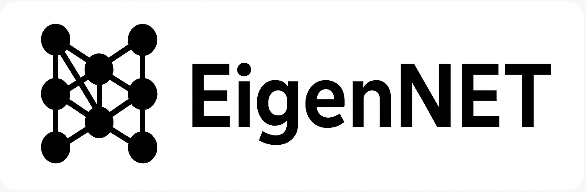
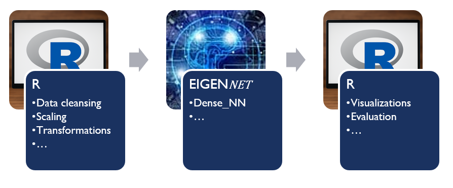

# EigenNET
## Independent. Efficient. Real C++ – Neural network without overhead

The purpose of the ***EigenNET project*** is to develop streamlined and highly efficient methods related to deep learning and make them available to the ML/DL community. The development tool for these methods is C/C++, and the methods are integrated into an R (Python, etc.) workflow so that complex pre- and post-processing steps do not burden the C/C++ methods. Exemplary workflows in R are of course presented here.

*To put it in a nutshell, oversized frameworks such as TensorFlow are not needed. The principle is: “Use the right tool for the work to be done!”* Instead, it relies on the lean and precise *Eigen library* to perform linear algebra operations at lightning speed and with minimal memory usage.

The ***EigenNET project*** demonstrates how modern neural networks can be trained efficiently even in resource-constrained environments—ideal for embedded systems, scientific prototypes, or simply for anyone who loves C++ and wants or needs to avoid unnecessary overhead.

### Dense_NN, the first C++ program of the EigenNET project.

**Dense_NN** is a compact, powerful C++ program for the efficient implementation and training of **dense networks**. 

### Features:
<ul>
<li>Dense network architecture with adjustable depth and activation functions</li>
<li>Eigen-based matrix operations for maximum speed</li>
<li>Minimal code footprint, maximum control</li>
<li>Ideal for demonstrations, teaching, and research</li>
</ul>

### EigenNET and R as Startegic Partner
Why the statistical environment ***R***? While *Dense_NN* trains the neural network efficiently and resource-conserving in C++, ***R*** handles tasks related to data preparation and analysis - in line with a clear separation of responsibilities and capabilities.

.

Of course, other environments such as Python are also possible partners. It's all about using the right tool for the concrete task. 

### Here is an overview of what Dense_NN does ...

.

### ... and all this without a gigantic framework such as TensorFlow!

